# 🫁 MyAsthmaJournal

<div align="center">

[](https://flutter.dev)
[](https://dart.dev)
[](https://firebase.google.com)
[](https://pub.dev/packages/get)
[](https://flutter.dev)
[](LICENSE)

<br/>

**A Smart, Real-Time Asthma Symptom Tracking, Medication Monitoring & Healthcare Collaboration Mobile App.**

*Empowering patients and caregivers to take control of asthma through intelligent medication tracking, automated emergency warnings, interactive health analytics, and clinical provider integration.*

[Explore Features](#-key-features) • [UI Showcase](#-ui-showcase) • [Tech Stack](#-tech-stack--architecture) • [Getting Started](#-getting-started) • [Portfolio Showcase](#-portfolio-showcase-snippet)

</div>

---

## 📌 Overview

**MyAsthmaJournal** is an end-to-end mobile health (mHealth) Flutter application designed to bridge the gap between asthma patients, caregivers, and medical institutions. Managing asthma requires consistent symptom tracking and prompt response to acute flare-ups. 

With **MyAsthmaJournal**, users can effortlessly log symptoms and inhaler dosages, view weekly health trends, receive immediate clinical safety alerts when inhaler usage exceeds safe limits, manage dependent family members, and connect with verified healthcare centers.

### 🌟 Why MyAsthmaJournal?
- **Immediate Alerting**: High-frequency inhaler triggers automatically fire push alerts and prompt immediate emergency medical action.
- **Dependent / Pediatric Support**: Caregivers can switch between multiple profiles to monitor children or elderly family members.
- **Connected Healthcare**: Directly link patient records with hospitals and healthcare providers with approval tracking.
- **Community Engagement**: Discover and register for asthma awareness events and healthcare workshops.

---

## ✨ Key Features

| Category | Description |
|---|---|
| 🚨 **Smart Medication & Safety Alerts** | Logs daily intake of relievers and controllers (e.g., Blue Inhaler Salbutamol, Gas Nebulizer, Ventolin Syrup). Automatically triggers a critical high-usage warning when rescue inhaler usage exceeds 4 times/day with immediate hospital navigation. |
| 📊 **Daily Symptom Trend & Analytics** | Interactive graphs powered by `fl_chart` charting daily symptom averages and weekly trends to identify triggers and flare-up patterns. |
| 👨‍👩‍👧 **Dependent & Profile Management** | Multi-profile management enabling parents and caregivers to maintain separate medical logs for dependents. |
| 🏥 **Healthcare Provider Directory** | Search and connect with healthcare facilities (e.g., Hospital Universiti Kebangsaan Malaysia, Hospital Islam Az-Zahrah). Real-time status indicators (`Approved`, `Pending`, `Rejected`). |
| 📅 **Healthcare Events & Workshops** | Community events hub for national asthma conferences, webinars, and educational seminars with built-in RSVP and participant tracking. |
| 🔔 **Intelligent Notifications** | Push and local notifications via `flutter_local_notifications` for scheduled reminders and critical clinical alerts. |
| 🔐 **Secure Cloud Backend** | Firebase Authentication, Cloud Firestore real-time NoSQL database, and secure cloud storage for avatars and medical attachments. |

---

## 📱 UI Showcase

The app features an intuitive, accessible healthcare UI designed for both everyday patient logging and high-urgency clinical alerting.

### 🌟 1. Onboarding & Authentication Flow
| 🚀 Welcome Onboarding | 🔐 Sign In & OAuth | 📝 User & Provider Sign Up | ✉️ Email Verification |
| :---: | :---: | :---: | :---: |
| 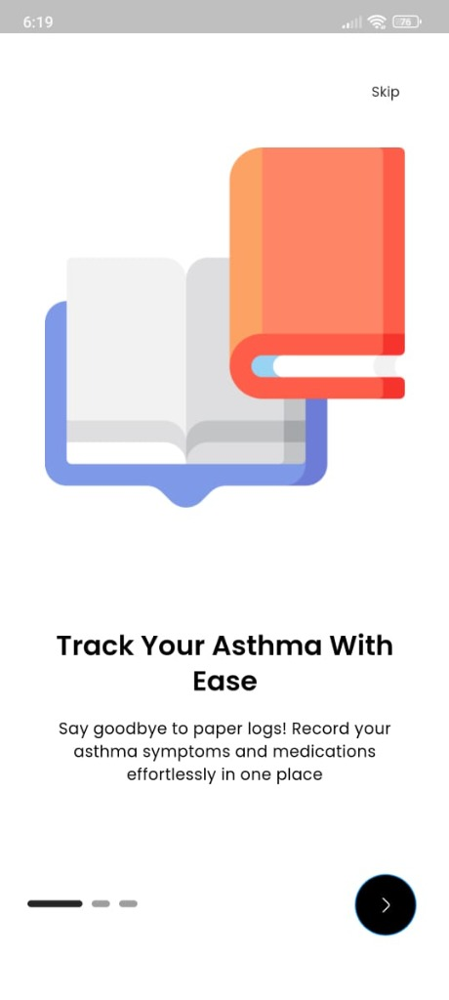 | 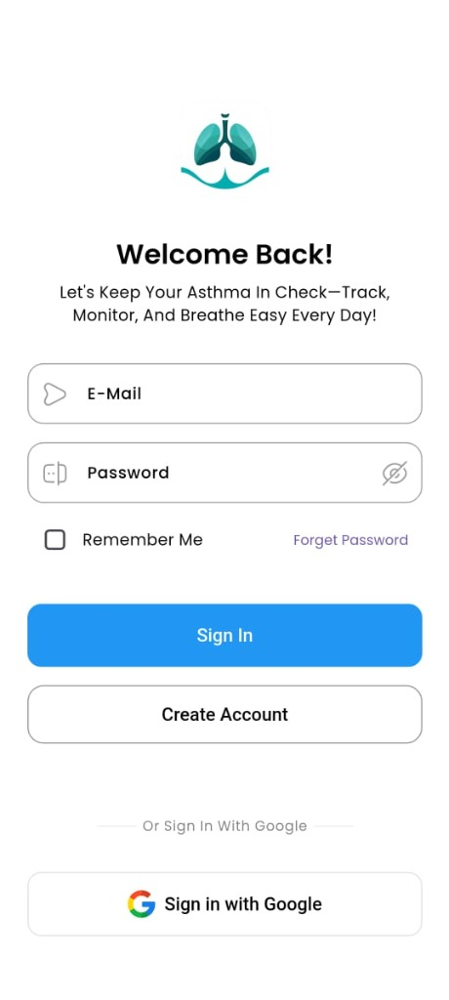 | 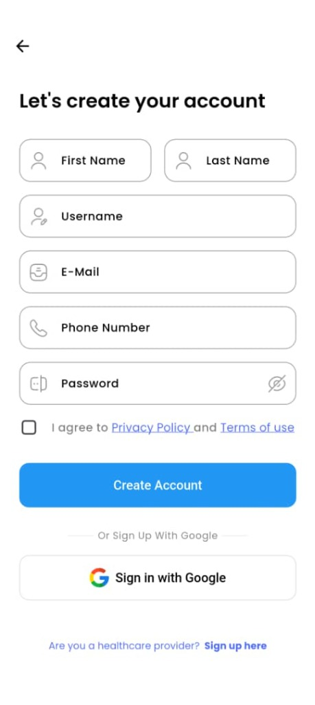 | 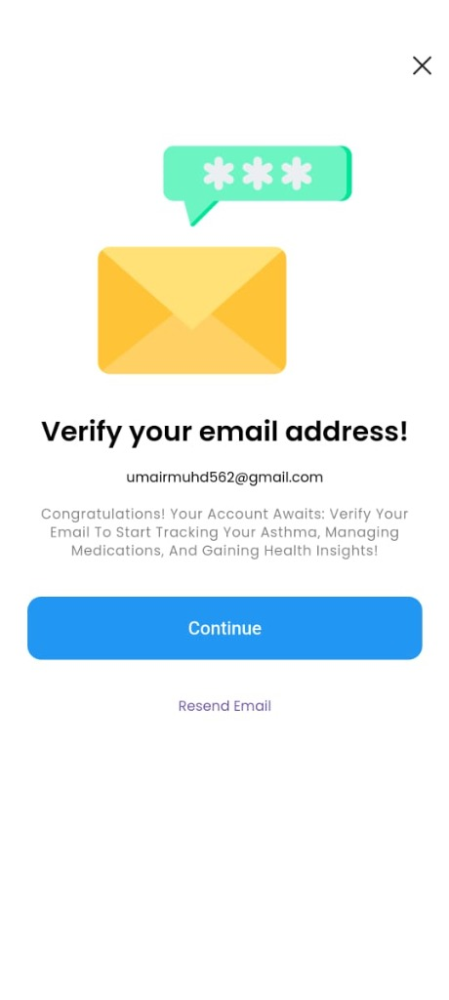 |
| *Intuitive onboarding flow highlighting asthma tracking features* | *Clean sign-in interface with Email, Password & Google OAuth* | *Dedicated registration paths for patients and healthcare providers* | *Secure email confirmation with Resend Email support* |

### 📖 2. Asthma Diary (Symptom & Medication Tracking)
| 🩺 Log Symptoms | 💊 Log Medication Intake |
| :---: | :---: |
| 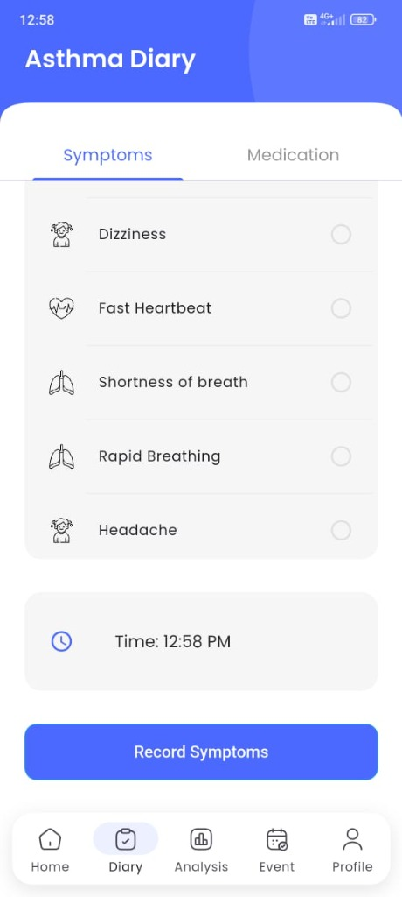 | 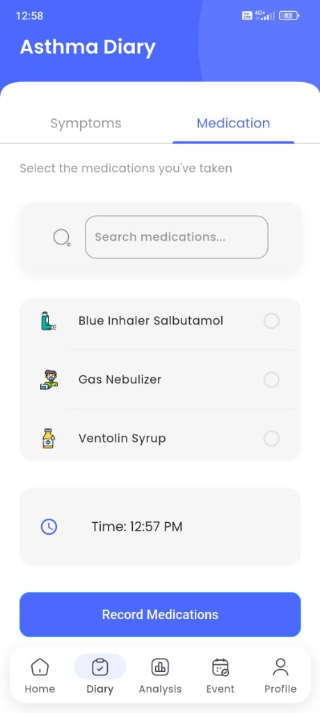 |
| *Track dizziness, fast heartbeat, shortness of breath, rapid breathing, and headache* | *Record doses of Salbutamol inhaler, nebulizer treatments, or syrups with precise timestamps* |

### 📊 3. Interactive Analytics & Health Trends (`fl_chart`)
| 📈 Symptom Statistics & Trends | 📉 Medication Usage Trends |
| :---: | :---: |
| 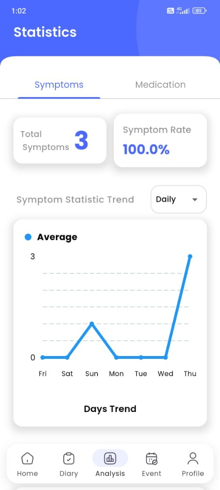 | 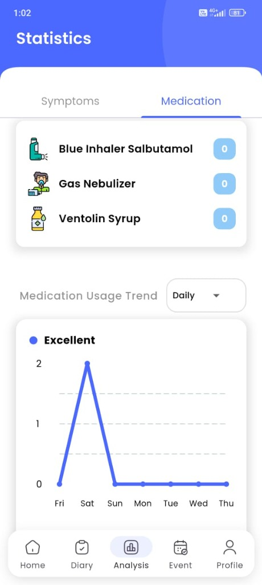 |
| *Aggregated symptom count, rate %, and interactive daily/weekly trend curves* | *Track reliever frequency over time to evaluate asthma stability* |

### 🚨 4. Daily Dashboard & Emergency Safety Alert
| 📅 Daily Health Dashboard | ⚠️ Clinical High-Usage Alert |
| :---: | :---: |
| 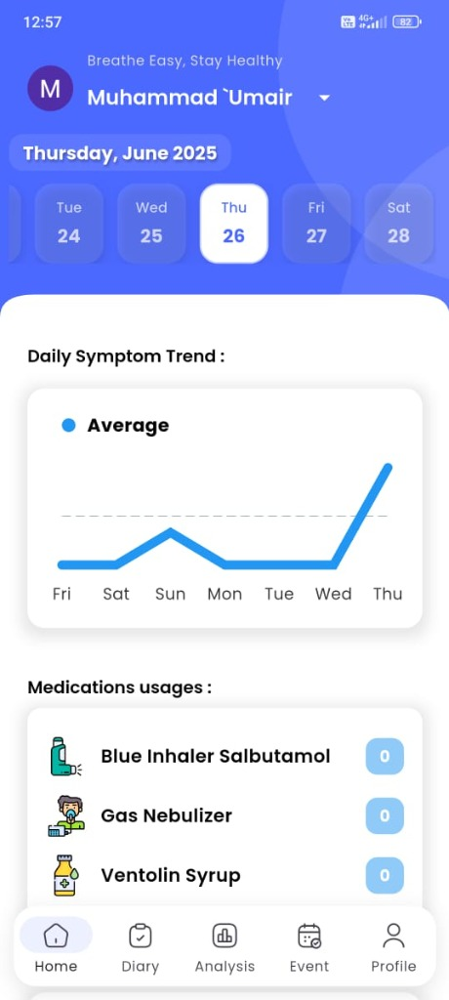 | 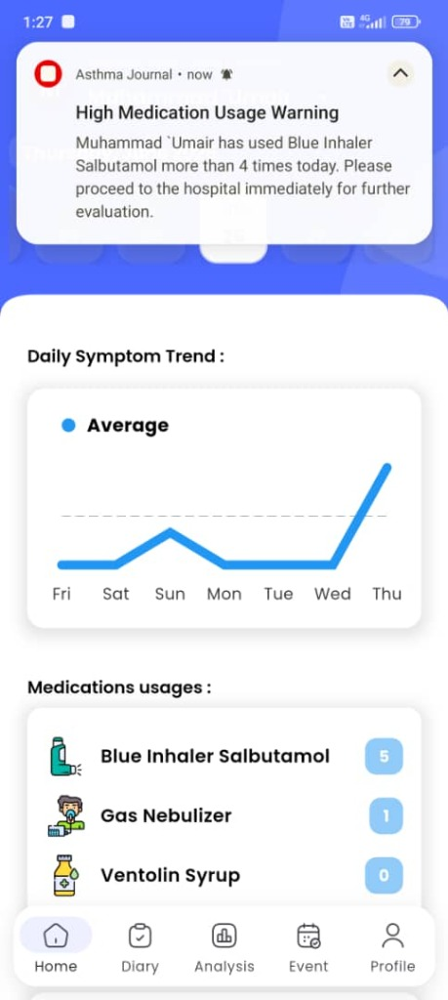 |
| *Calendar timeline, daily symptom averages & medication count* | *Automated high-frequency inhaler alert (>4 puffs/day) triggering immediate hospital routing* |

### 🏥 5. Healthcare Provider Collaboration & Verification
| 📋 Healthcare Providers Directory | 🛡️ Clinical Approval Workflow |
| :---: | :---: |
| 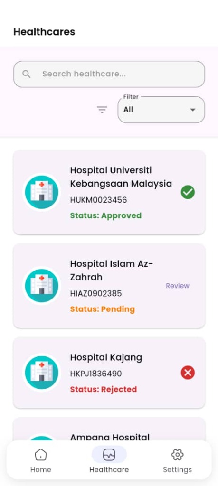 | 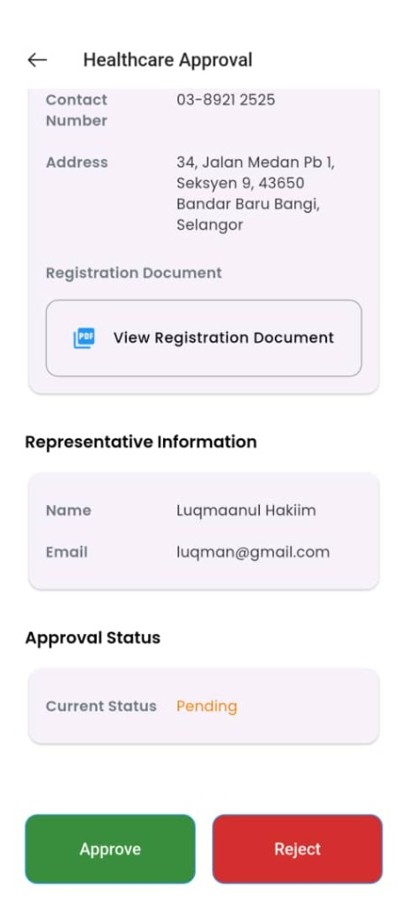 |
| *Track status of linked healthcare centers (Approved, Pending, Rejected)* | *Admin review of registration documents and verified representative info* |

### 📅 6. Community & Healthcare Events
| 🌍 Asthma Conferences & Events | ➕ Schedule New Event |
| :---: | :---: |
| 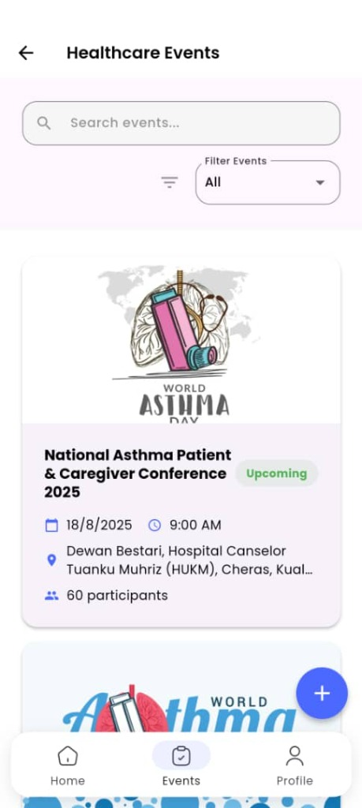 | 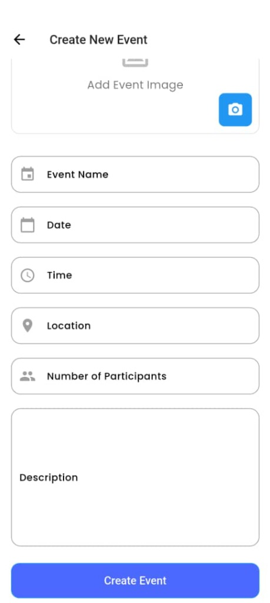 |
| *Browse upcoming events (e.g. World Asthma Day & National Conferences)* | *Create community health seminars with participant capacity and venue info* |

> 💡 **All 15 UI screens are showcased above** — covering the complete user journey from onboarding to analytics, caregiver management, healthcare collaboration, and clinical emergency alerting.

---

## 🛠 Tech Stack & Architecture

### **Frontend & Framework**
- **Flutter (Dart 3.x)**: Cross-platform mobile development for Android & iOS.
- **GetX**: High-performance reactive state management, micro-dependency injection, and route navigation.
- **fl_chart**: Interactive charting library for symptom trend visualization.
- **Iconsax & Cupertino Icons**: Clean, accessible iconography.
- **Lottie & Shimmer**: Fluid animations and skeleton loaders for responsive UX.

### **Backend & Services**
- **Firebase Authentication**: Email/Password and Google OAuth sign-in.
- **Cloud Firestore**: Real-time cloud database for symptoms, events, and provider links.
- **Firebase Cloud Storage**: Secure asset and document uploads.
- **Flutter Local Notifications**: Scheduled daily reminders and priority emergency alerts.
- **GetStorage & SharedPreferences**: Fast on-device key-value caching.

### **Architecture Overview**
The codebase follows a modular, feature-first Clean Architecture pattern:

```text
lib/
├── app.dart                   # Global app config, themes, bindings
├── firebase_options.dart      # Platform-specific Firebase credentials
├── main.dart                  # Application entry point & service initialization
├── data/                      # Repositories, data providers, remote APIs
│   └── repositories/          # Authentication, admin & user data layers
├── features/                  # Domain-specific feature modules
│   ├── asthma/                # Symptom diary, medication logging & analytics
│   ├── authentication/        # Login, signup, onboarding, password reset
│   ├── events/                # Healthcare events, conferences & seminars
│   ├── notification/          # Notification service & emergency alert handlers
│   ├── participants/          # Event participant tracking
│   ├── personalization/       # User profile, dependent profiles & settings
│   └── reminder/              # Medication schedule reminders
└── utils/                     # Shared constants, helpers, theme & validators
```

---

## 🚀 Getting Started

Follow these steps to run the project locally on your machine.

### Prerequisites
- [Flutter SDK](https://docs.flutter.dev/get-started/install) (`^3.24.0` or higher)
- [Dart SDK](https://dart.dev/get-dart) (`^3.5.0` or higher)
- Android Studio / VS Code with Flutter extension
- An active Android Emulator or physical device

### 1. Clone the Repository
```bash
git clone https://github.com/umairasri/myasthmajournal.git
cd myasthmajournal
```

### 2. Install Dependencies
```bash
flutter pub get
```

### 3. Configure Firebase
1. Create a Firebase project in the [Firebase Console](https://console.firebase.google.com/).
2. Enable **Authentication** (Email/Password & Google Sign-In).
3. Create a **Cloud Firestore** database.
4. Place your `google-services.json` inside `android/app/`.
5. Run the FlutterFire CLI or update `lib/firebase_options.dart` with your project keys:
   ```bash
   flutterfire configure
   ```

### 4. Run the Application
```bash
# Run on connected device or emulator
flutter run
```

---

## 💼 Portfolio Showcase Snippet

If you are featuring **MyAsthmaJournal** on your personal developer portfolio website, here is a ready-to-use project description card:

### Markdown / Text Summary
```markdown
### 🫁 MyAsthmaJournal — Flutter & Firebase Asthma Management App
- **Overview**: A patient-caregiver asthma monitoring mobile app featuring automated high-medication safety alerts, fl_chart symptom analytics, dependent family management, and healthcare clinic verification.
- **Tech Stack**: Flutter, Dart, GetX, Firebase (Auth, Firestore, Cloud Storage), Local Notifications, fl_chart.
- **Key Highlight**: Built a smart threshold-detection algorithm that triggers high-priority clinical emergency alerts when rescue inhaler usage exceeds safe limits (>4 times/day).
- **GitHub**: [github.com/umairasri/myasthmajournal](https://github.com/umairasri/myasthmajournal)
```

### HTML / React Card Component
```html
<div class="project-card">
  
  <div class="project-content">
    <h3>MyAsthmaJournal</h3>
    <p class="project-description">
      Cross-platform Flutter mobile application designed for asthma tracking, caregiver-dependent management, and clinical collaboration. Features real-time emergency medication alerts and trend analytics.
    </p>
    <div class="project-tags">
      <span class="tag">Flutter</span>
      <span class="tag">Dart</span>
      <span class="tag">Firebase</span>
      <span class="tag">GetX</span>
      <span class="tag">Healthcare</span>
    </div>
    <div class="project-links">
      <a href="https://github.com/umairasri/myasthmajournal" target="_blank" rel="noopener noreferrer">View on GitHub</a>
    </div>
  </div>
</div>
```

---

## 📄 License

This project is licensed under the MIT License — see the [LICENSE](LICENSE) file for details.

---

<div align="center">
  <sub>Developed with ❤️ by <a href="https://github.com/umairasri">Muhammad 'Umair</a></sub>
</div>
